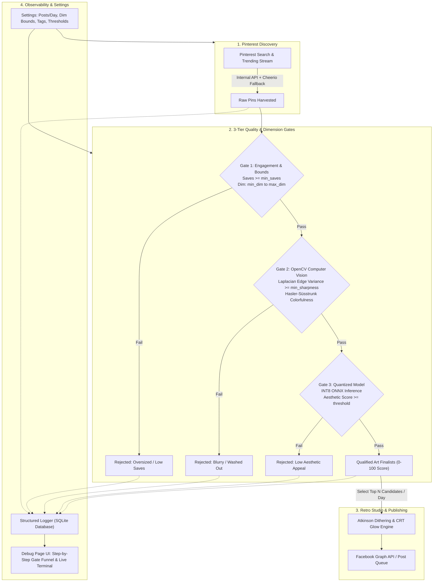

# Mr. Bit: Autonomous Pinterest Art Discovery & 1-Bit Retro Studio
> **Architecture & Production System Manual**

A fully autonomous, cron-driven production system that scrapes and discovers trending digital art and cinematic visuals from **Pinterest**, filters them through an ultra-fast **3-Tier Quality & Dimension Safety Pipeline** (Saves + OpenCV + Quantized ONNX), converts winning candidates into 1-bit retro CRT dithered art, and publishes them to a linked Facebook Page.

---

## Table of Contents
1. [System Overview](#1-system-overview)
2. [Core Architecture & Pipeline](#2-core-architecture--pipeline)
3. [The 3-Tier Quality Scoring Pipeline](#3-the-3-tier-quality-scoring-pipeline)
4. [Debug & Observability Dashboard (`/debug`)](#4-debug--observability-dashboard)
5. [Advanced Settings & Multi-Post Volume](#5-advanced-settings--multi-post-volume)
6. [Database Schema](#6-database-schema)
7. [Tech Stack](#7-tech-stack)
8. [Installation & Quickstart](#8-installation--quickstart)
9. [API Reference](#9-api-reference)

---

## 1. System Overview

**Mr. Bit** continuously monitors Pinterest search and trending visual streams for high-engagement digital art, concept art, cyberpunk scenery, and illustrations (replacing legacy museum painting sources). 

To prevent server memory crashes and slow network downloads, the system strictly enforces **dimension bounds** (rejecting oversized 4K/8K images) while filtering out low-effort or blurry uploads. Candidates must qualify through three sequential inspection gates before being selected, converted into glowing 1-bit CRT dithered artwork, and scheduled for daily publication.

---

## 2. Core Architecture & Pipeline



---

## 3. The 3-Tier Quality Scoring Pipeline

Candidates must pass three consecutive gates:

### Gate 1: Engagement & Dimension Safety Gate
* **Purpose:** Ensures popularity via real audience curation while protecting server RAM from oversized files.
* **Checks:**
  * `saves_count >= min_saves` (default: $\ge 50$ saves/repins).
  * `width, height <= max_dimension` (default: $\le 2048\text{px}$) — **Prevents downloading massive 4K/8K assets**.
  * `width, height >= min_dimension` (default: $\ge 600\text{px}$) — Skips low-res thumbnails and icons.

### Gate 2: OpenCV Computer Vision Metrics
* **Purpose:** Pure mathematical visual quality inspection (runs in $< 3\text{ms}$ per image).
* **Metrics:**
  * **Laplacian Edge Variance:** Convolves grayscale pixel matrix with a $3 \times 3$ Laplacian kernel. Low variance ($< 20$) identifies blurry screenshots or out-of-focus imagery.
  * **Hasler & Süsstrunk Colorfulness Index:** Computes chromatic dispersion across opposing color spaces ($rg = |R - G|$, $yb = |0.5(R + G) - B|$) to verify dynamic palette intentionality.
  * **RMS Luminance Contrast:** Verifies tonal range and contrast depth for clean Atkinson dithering.

### Gate 3: Quantized ONNX Aesthetic Model
* **Purpose:** Semantic aesthetic appeal evaluation without GPU bloat.
* **Implementation:** Runs an INT8 quantized ONNX vision model on CPU via `onnxruntime-node`.
* **Output:** Normalized aesthetic score on a clean $1.0 - 10.0$ scale.
* **Final Composite Score:**
  $$\text{Score} = \min\left(100, (\text{Aesthetic} \times 7) + (\text{Sharpness} \times 0.2) + \min(10, \log_{10}(\text{Saves}) \times 3.3)\right)$$

---

## 4. Debug & Observability Dashboard (`/debug`)

The `/debug` page provides complete visibility into every step of the pipeline:

1. **Gate Funnel Summary:**
   * Visual count cards tracking: *Scraped Pins* $\rightarrow$ *Gate 1 Drops* $\rightarrow$ *Gate 2 Drops* $\rightarrow$ *Gate 3 Drops* $\rightarrow$ *Qualified Finalists*.
2. **Candidate Gate Matrix:**
   * Interactive tabs (`All`, `Qualified`, `Gate 1 Fail`, `Gate 2 Fail`, `Gate 3 Fail`).
   * Individual candidate inspection cards showing Pinterest saves, exact dimensions, Laplacian sharpness, ONNX score, and precise rejection reasons (e.g. `Rejected: Oversized image (3840x2160 > 2048px limit)`).
3. **Live Diagnostic Terminal:**
   * Real-time streaming logs with stage tags (`[SCRAPE]`, `[STAGE_1_ENGAGEMENT]`, `[STAGE_2_OPENCV]`, `[STAGE_3_ONNX]`, `[DITHER]`, `[PUBLISH]`).
   * Filter logs by level (`INFO`, `DEBUG`, `WARN`, `ERROR`) or keyword search.
4. **"Trigger Pipeline Now" Button:**
   * Manually trigger an on-demand Pinterest discovery and scoring run directly from the UI.

---

## 5. Advanced Settings & Multi-Post Volume

Configure system parameters under **Settings** (`/automation`):

| Setting | Default | Description |
| :--- | :--- | :--- |
| **Automation Master Switch** | `Enabled` | Toggles background cron execution. |
| **Posts Each Day** | `1` (1 to 8) | Number of posts to publish daily (evenly distributed). |
| **Anchor Posting Time** | `10:00` | Start time for daily scheduling. |
| **Pinterest Search Tags** | 4 tags | Custom keywords (e.g., `#concept art`, `#cyberpunk landscape`). |
| **Max Dimension** | `2048 px` | Upper limit for image width/height (protects memory). |
| **Min Dimension** | `600 px` | Lower limit for image width/height. |
| **Min Pinterest Saves** | `50` | Minimum saves required to pass Gate 1. |
| **Min Laplacian Sharpness** | `20.0` | Minimum edge sharpness to pass Gate 2. |
| **Min Aesthetic Score** | `5.0` / 10 | Minimum model score to pass Gate 3. |
| **Caption Template** | Custom | Predefined caption with hashtags for Facebook posting. |

---

## 6. Database Schema

Managed via SQLite with Write-Ahead Logging (`WAL`):

* **`image_candidates`**: Stores discovered pins, saves count, dimensions, OpenCV metrics, ONNX aesthetic score, gate stage (`scraped`, `rejected_stage_1`, `stage_1_passed`, `rejected_stage_2`, `stage_2_passed`, `rejected_stage_3`, `passed_all_stages`), rejection reasons, and thumbnails.
* **`posts`**: Stores published and pending Facebook post records, dithered output paths, captions, and Facebook post IDs.
* **`settings`**: Configuration row for scheduler, volume, dimension limits, and thresholds.
* **`pipeline_logs`**: Persisted structured log stream with run ID, stage, level, and metadata.

---

## 7. Tech Stack

* **Backend:** Node.js, Express 5, Better-SQLite3, Sharp (C++ libvips), ONNX Runtime (`onnxruntime-node`), Axios, Cheerio, Node-Cron.
* **Frontend:** React 18, Vite, Tailwind CSS, Lucide React, React Router 6, React Hot Toast.
* **Rendering:** Atkinson Dithering Algorithm, Canvas 2D, CRT scanline & Gaussian glow compositor.

---

## 8. Installation & Quickstart

### Prerequisites
* **Node.js**: v18.0+ 
* **npm**: v9.0+

### Setup
```bash
# 1. Clone repository
git clone https://github.com/Abubakkar-Khan/Mr_Bit.git
cd Mr_Bit

# 2. Install all dependencies (client and server)
npm run install:all

# 3. Configure Environment Variables
# Create server/.env with:
PORT=5000
DATABASE_URL=data/asciiman.db
FB_PAGE_ID=your_page_id_here
FB_PAGE_ACCESS_TOKEN=your_access_token_here
```

### Running Locally
```bash
# Start backend server (port 5000)
npm run dev --prefix server

# In a separate terminal, start frontend (port 5173)
npm run dev --prefix client
```

Navigate to `http://localhost:5173/` for the dashboard, or `http://localhost:5173/debug` for real-time pipeline diagnostics.

---

## 9. API Reference

### Pipeline & Discovery
* `POST /api/images/fetch` — Trigger Pinterest discovery and 3-tier scoring.
* `GET /api/images/candidates` — Get today's qualified candidate pool.
* `GET /api/images/debug/candidates?stage=...` — Filter candidates across all evaluation gates.
* `POST /api/images/select/:id` — Convert candidate to retro CRT art and publish immediately.

### Observability & Logging
* `GET /api/logs?limit=100&stage=...&level=...` — Retrieve diagnostic logs.
* `GET /api/logs/status` — Get active run ID and current pipeline stage.
* `DELETE /api/logs` — Purge log history.

### Automation & Configuration
* `GET /api/settings` — Get active settings.
* `PUT /api/settings` — Update volume, tags, dimension bounds, and thresholds.
* `POST /api/automation/run` — Run the full pipeline end-to-end.
* `POST /api/automation/toggle` — Toggle master automation switch.
