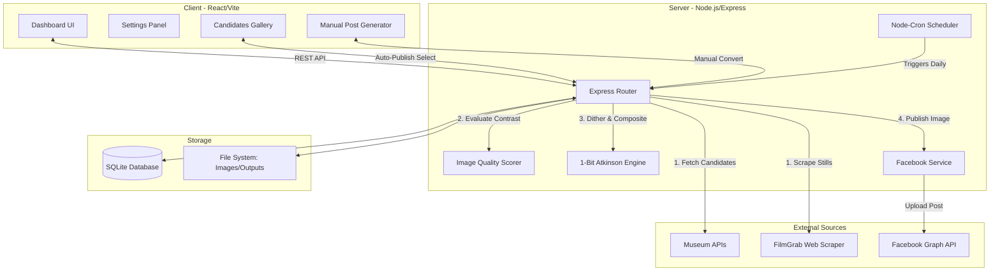
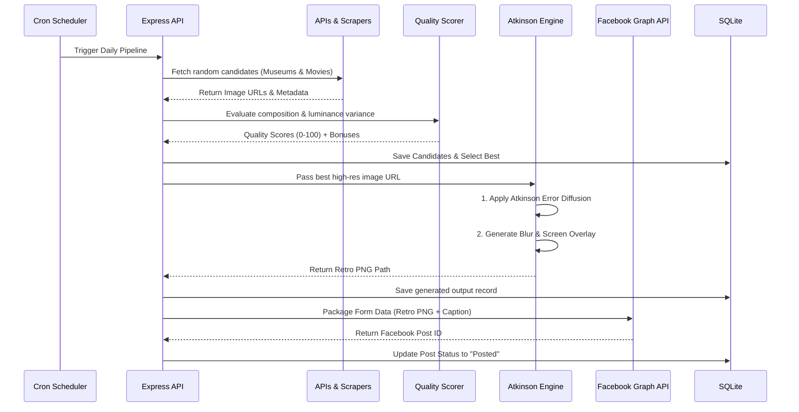
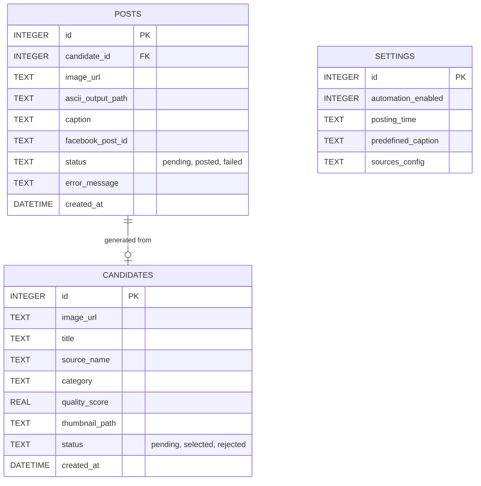

# ASCII Man: Autonomous 1-Bit Retro Art System
> **Software Requirements Specification & System Architecture Report**

A fully automated, cron-driven system that discovers high-quality images and cinematic shots from the internet, evaluates them, converts them into 1-bit retro CRT dithered art, and autonomously publishes them to a Facebook Page.

---

## Table of Contents
1. [System Overview](#1-system-overview)
2. [Core Features](#2-core-features)
3. [System Architecture](#3-system-architecture)
4. [Automation & Data Pipeline (Sequence Diagram)](#4-automation--data-pipeline)
5. [Database Schema (Entity-Relationship Diagram)](#5-database-schema)
6. [Tech Stack](#6-tech-stack)
7. [Installation & Deployment](#7-installation--deployment)
8. [Environment Configuration](#8-environment-configuration)

---

## 1. System Overview
**ASCII Man** operates as a completely autonomous pipeline. It queries both public domain image APIs (Metropolitan Museum, Art Institute of Chicago, Wikimedia, Openverse) and custom web scrapers (FilmGrab for cinematic stills). 

The system scores all fetched candidates based on contrast, composition, and category. The highest-scoring image is processed through a proprietary **Atkinson Dithering Engine** to create a 1-bit black-and-white retro image with a simulated CRT glow effect. Finally, the system automatically packages and uploads the image to a linked Facebook Page using the Graph API.

---

## 2. Core Features
- **Intelligent Scraping & APIs**: Connects to 4+ Museum REST APIs and utilizes `cheerio` to web-scrape high-resolution cinematic stills.
- **Image Quality Scoring**: Downloads thumbnails and evaluates raw pixel luminance variance to ensure optimal contrast for dithering.
- **Atkinson Dithering Engine**: A custom image manipulation pipeline that discards 8-bit color for a pristine, 1-bit error-diffused pixel map, heavily stylized with Gaussian blurs and screen overlays for a glowing CRT bleed effect.
- **Gallery Auto-Publish**: Manually click 'Select' on any image in the dashboard to immediately convert and post it.
- **Unattended Cron Operation**: Built-in daemon schedules daily operations at user-defined intervals.

---

## 3. System Architecture

The architecture relies on a decoupled Client/Server model.



---

## 4. Automation & Data Pipeline

The following sequence diagram outlines the end-to-end autonomous flow, which can also be triggered manually via the dashboard.



---

## 5. Database Schema

The database utilizes SQLite for lightweight, fast, and reliable local persistence.



---

## 6. Tech Stack

- **Frontend:** React 19, Vite, Tailwind CSS v4, Lucide React (Icons), React Hot Toast
- **Backend:** Node.js, Express, Better-SQLite3, Axios, Cheerio (Web Scraping), Node-Cron, Multer
- **Image Processing Engine:** `sharp` (Libvips buffer manipulation)

---

## 7. Installation & Deployment

1. **Clone the repository:**
   Ensure you have Node.js (v18+) installed.

2. **Install Backend Dependencies:**
   ```bash
   cd server
   npm install
   ```

3. **Install Frontend Dependencies:**
   ```bash
   cd client
   npm install
   ```

4. **Start the Application Services:**
   Open two terminal instances.
   
   *Terminal 1 (Backend):*
   ```bash
   cd server
   npm run dev
   ```
   
   *Terminal 2 (Frontend):*
   ```bash
   cd client
   npm run dev
   ```

---

## 8. Environment Configuration

Create a `.env` file in the `server/` directory. The application requires proper Facebook Developer credentials to publish autonomously.

```env
# server/.env
FACEBOOK_PAGE_ID=your_page_id_here
FACEBOOK_PAGE_ACCESS_TOKEN=your_long_lived_page_access_token_here
```

**To obtain these credentials:**
1. Go to [Facebook Developers](https://developers.facebook.com/).
2. Create an Application.
3. Request `pages_manage_posts` and `pages_read_engagement` permissions.
4. Generate a Page Access Token for the target page.
